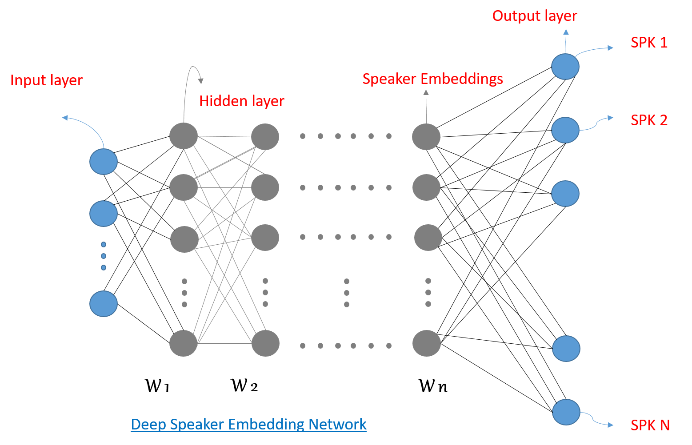

# SpeakerVerification-TF 
Speaker Embedding for verification / identification task using Tensorflow

#### Csv file Format:
|Index|filename|	speakers	|speaker_id	|duration|
|-----|--------|	----------|-----------|---------|
|0	|/home/manish_kumar/speaker_recognition/data/testutt1.wav|	Jhon|	253|	11.46|
|1	|/home/manish_kumar/speaker_recognition/data/testutt2.wav|	Jack|	69|	14.32|
|2	|/home/manish_kumar/speaker_recognition/data/testutt3.wav|	Nat|	750|	4.62|
|3	|/home/manish_kumar/speaker_recognition/data/testutt4.wav|	David|	723	|10.54|

#### Start Training
python train_softmax.py --chkpt chkpt1 --E_train 50 --lr 0.0001 --bs 64 --csv ted_train.csv
